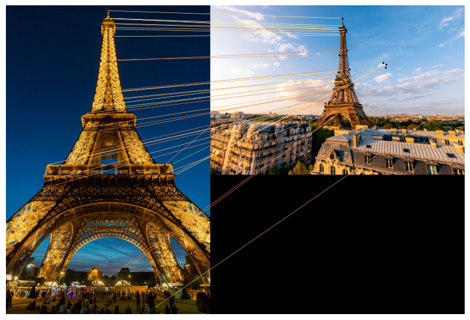

# Image Comparison
## Detect and Visualize the differences between two images
code snippet: [image-comparison](difference_between_two_image.py)  
**Output:** 

  
  

## SuperGlue Image Matching Model
- [x]  SuperGlue, a neural network model(GNN) designed to improve the matching of keypoints between pairs of images. Keypoints are distinctive points in an image, such as corners or blobs, that algorithms use to identify similarities between different images. Traditional methods often struggle with accurately matching these keypoints, especially when images have variations in viewpoint, lighting, or occlusions.  
colab: [notebook](https://colab.research.google.com/drive/1NhwofZFzy7IMN4irN-jC-9LZy7dx_GZ2?usp=sharing)
